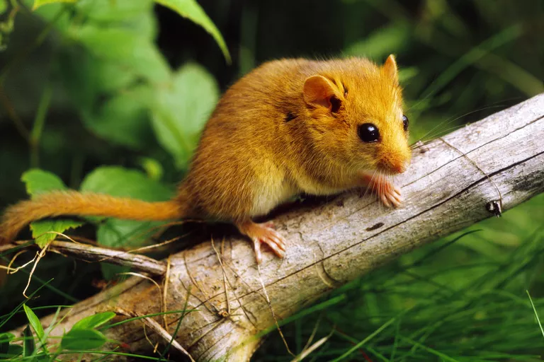
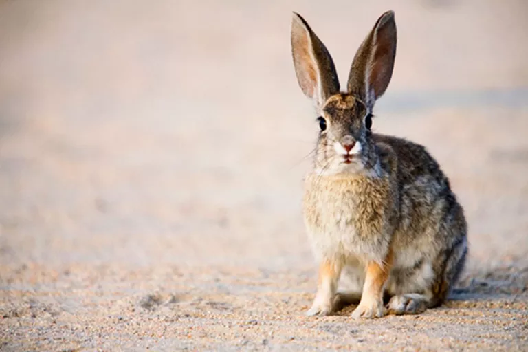
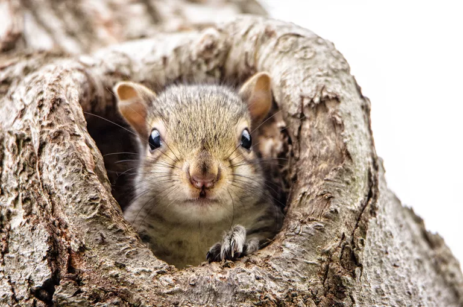

---
layout:post
title:Test Chordates
data:2019-11-12 05:50:55 +0800
categories:jekyll
tags:English
author:Sherry
mathjax:true
---

### [1] Chordates——Scientific name: Chordata

*by Laura Klappenbach[^2]  Updated February 20, 2019*

Chordates (Chordata) are a group of animals that includes vertebrates, tunicates, lancelets. Of these, the vertebrates—lampreys, mammals, birds, amphibians, reptiles, and fishes—are the most familiar and are the group to which humans belong.

Chordates are bilaterally symmetrical, which means there is a line of symmetry that divides their body into halves that are roughly mirror images of each other. Bilateral symmetry is not unique to chordates. Other groups of animals—arthropods, segmented worms, and echinoderms—exhibit bilateral symmetry (although in the case of echinoderms, they are bilaterally symmetrical only during the larval stage of their life cycle; as adults they exhibit pentaradial symmetry).

All chordates have a notochord that is present during some or all of their life cycle. A notochord is a semi-flexible rod that provides structural support and serves as an anchor for the animal's large body muscles. The notochord consists of a core of semi-fluid cells enclosed in a fibrous sheath. The notochord extends the length of the animal's body. In vertebrates, the notochord is only present during the embryonic stage of development, and is later replaced when vertebrae develop around the notochord to form the backbone. In tunicates, the notochord remains present throughout the animal's entire life cycle.

Chordates have a single, tubular nerve cord that runs along the back (dorsal) surface of the animal which, in most species, forms a brain at the front (anterior) end of the animal. They also have pharyngeal pouches that are present at some stage in their life cycle. In vertebrates, pharyngeal pouches develop into various different structures such as the middle ear cavity, the tonsils, and the parathyroid glands. In aquatic chordates, the pharyngeal pouches develop into pharyngeal slits which serve as openings between the pharyngeal cavity and the external environment.

Another characteristic of chordates is a structure called the endostyle, a ciliated groove on the ventral wall of the pharynx that secretes mucus and traps small food particles that enter the pharyngeal cavity. The endostyle is present in tunicates and lancelets. In vertebrates, the endostyle is replaced by the thyroid, an endocrine gland located in the neck.

**Key Characteristics**

The key characteristics of chordates include:

+ notochord
+ dorsal tubular nerve cord
+ pharyngeal pouches and slits
+ endostyle or thyroid
+ postnatal tail

**Species Diversity**

More than 75,000 species

**Classification**

Chordates are classified within the following taxonomic hierarchy:

Animals > Chordates

Chordates are divided into the following taxonomic groups:

+ Lancelets (Cephalochordata) - There are about 32 species of lancelets alive today. Members of this group have a notochord that persists throughout their entire life cycle. Lancelets are marine animals that have long narrow bodies. The earliest known fossil lancelet,Yunnanozoon, lived about 530 million years ago during the Cambrian Period. Fossil lancelets were also found in the famous fossil beds of the Burgess Shale in British Columbia.
+ Tunicates (Urochordata) - There are about 1,600 species species of tunicates alive today. Members of this group include sea squirts, larvaceans and thaliaceans. Tunicates are marine filter-feeders, most of which live a sessile life as adults, attached to rocks or other hard surfaces on the seafloor.
+ Vertebrates (Vertebrata) - There are about 57,000 species of vertebrates alive today. Members of this group include lampreys, mammals, birds, amphibians, reptiles and fishes. In vertebrates, the notochord is replaced during development by multiple vertebrae that make up the backbone.

**Sources**

Hickman C, Robers L, Keen S, Larson A, I'Anson H, Eisenhour D. Integrated Principles of Zoology 14th ed. Boston MA: McGraw-Hill; 2006. 910 p.

Shu D, Zhang X, Chen L. Reinterpretation of Yunnanozoon as the earliest known hemichordate. Nature. 1996;380(6573):428-430.

***

### [2] Ellis Island Immigration Center

*by Kimberly Powell[^4]  Updated April 22, 2019*

Ellis Island, a small island in New York Harbor, served as the site of American's first Federal immigration station. From 1892 to 1954, over 12 million immigrants entered the United States through Ellis Island. Today the approximately 100 million living descendants of these Ellis Island immigrants account for more than 40% of the country's population.

**The Naming of Ellis Island**
In the early 17th century, Ellis Island was no more than a small 2-3 acre lump of land in the Hudson River, just south of Manhattan. The Mohegan Indian tribe who inhabited the nearby shores called the island Kioshk or Gull Island. In 1628 a Dutch man, Michael Paauw, acquired the island and renamed it Oyster Island for its rich oyster beds.

In 1664, the British took possession of the area from the Dutch and the island was once again known as Gull Island for a few years, before being renamed Gibbet Island, following the hanging there of several pirates (gibbet refers to a gallows structure). This name stuck for over 100 years, until Samuel Ellis purchased the little island on January 20, 1785, and gave it his name.

**American Family Immigration History Center at Ellis Island**
Declared part of the Statue of Liberty National Monument in 1965, Ellis Island underwent a $162 million renovation in the 1980s and opened as a museum on September 10, 1990.

**Researching Ellis Island Immigrants 1892-1924**
The free Ellis Island Records database, provided online by the Statue of Liberty-Ellis Island Foundation, allows you to search by name, year of arrival, year of birth, town or village of origin, and ship name for immigrants who entered the U.S. at Ellis Island or the Port of New York between 1892 and 1924, the peak years of immigration. Results from the database of more than 22 million records provide links to a transcribed record and a digitized copy of the original ship manifest.

The Ellis Island immigrant records, available both online and through kiosks at the Ellis Island American Family Immigration History Center, will provide you with the following type of information about your immigrant ancestor:

+ Given name
+ Surname
+ Gender
+ Age at arrival
+ Ethnicity / Nationality
+ Marital status
+ Last Residence
+ Date of arrival
+ Ship of travel
+ Port of origin

You can also research the history of the immigrant ships that arrived at Ellis Island, NY, complete with photos.

If you believe your ancestor landed in New York between 1892 and 1924 and you can't find him or her in the Ellis Island database, then make sure you've exhausted all of your search options. Due to unusual misspellings, transcription errors and unexpected names or details, some immigrants may be difficult to locate.

Records of passengers that arrived at Ellis Island after 1924 aren't yet available in the Ellis Island database. These records are available on microfilm from the National Archives and your local Family History Center. Indexes exist for New York passenger lists from June 1897 to 1948.

**Visiting Ellis Island**
Each year, more than 3 million visitors from around the world walk through the Great Hall at Ellis Island. To reach the Statue of Liberty and Ellis Island Immigration Museum, take the Circle Line - Statue of Liberty Ferry from Battery Park in lower Manhattan or Liberty Park in New Jersey.

On Ellis Island, the Ellis Island Museum is located in the main immigration building, with three floors dedicated to the history of immigration and the important role played by Ellis Island in American history. Don't miss the famous Wall of Honor or the 30-minute documentary film "Island of Hope, Island of Tears." Guided tours of the Ellis Island Museum are available.

***

### [3] The Gestapo: Definition and History of the Nazi Secret Police

*by Robert McNamara[^5]  Updated September 27, 2019*

The Gestapo was the secret police of Nazi Germany, a notorious organization tasked with destroying political opponents of the Nazi movement, suppressing any opposition to Nazi policies, and persecuting Jews. From its origins as a Prussian intelligence organization, it grew into a sprawling and greatly feared apparatus of oppression.

The Gestapo investigated any person or organization suspected of opposing the Nazi movement. Its presence became pervasive in Germany and later in the countries the German military occupied.

> Key Takeaways: The Gestapo
>
> + The greatly feared Nazi secret police had its origins as a Prussian police force.
> + The Gestapo operated by intimidation. Using surveillance and interrogation under torture, the Gestapo terrorized entire populations.
> + The Gestapo collected information on anyone suspected of opposing Nazi rule, and specialized in hunting down those targeted for death.
> + As a secret police force, the Gestapo did not operate death camps, but it was generally instrumental in identifying and apprehending those who would be sent to the camps.

**Origins of the Gestapo**

The name Gestapo was a shortened form of the words Geheime Staatspolizei, meaning "Secret State Police." The organization's roots can be traced to the civilian police force in Prussia, which was transformed following a right-wing revolution in late 1932. The Prussian police was purged of anyone suspected of sympathy to left-wing politics and Jews.

When Hitler took power in Germany, he appointed one of this closest aides, Hermann Goering, as the minister of the interior in Prussia. Goering intensified the purge of the Prussian police agency, giving the organization powers to investigate and persecute enemies of the Nazi Party.

In the early 1930s, as various Nazi factions maneuvered for power, the Gestapo had to compete with the SA, the Storm Troops, and the SS, the elite guard of the Nazis. After complicated power struggles among Nazi factions, the Gestapo was made part of the security police under Reinhard Heydrich, a fanatical Nazi originally hired by SS chief Heinrich Himmler to create an intelligence operation.

**Gestapo vs. the SS**

The Gestapo and the SS were separate organizations, yet shared the common mission of destroying any opposition to Nazi power. As both organizations were eventually headed by Himmler, the lines between them can appear blurred. In general, the SS operated as a uniformed military force, the elite shock troops enforcing Nazi doctrine as well as engaging in military operations. The Gestapo operated as a secret police organization, utilizing surveillance, coercive interrogation to the point of torture, and murder.

Overlap between SS and Gestapo officers would occur. For instance, Klaus Barbie, the notorious head of the Gestapo in occupied Lyons, France, had been an SS officer. And information obtained by the Gestapo was routinely used by the SS in operations aimed at partisans, resistance fighters, and perceived enemies of the Nazis. In many operations, particularly in the persecution of Jews and the mass murder of "The Final Solution," the Gestapo and the SS effectively operated in tandem. The Gestapo did not operate the death camps, but the Gestapo was generally instrumental in identifying and apprehending those who would be sent to the camps.

**Gestapo Tactics**
The Gestapo became obsessed with accumulating information. When the Nazi Party rose to power in Germany, an intelligence operation aimed at any potential enemies became a vital part of the party apparatus. When Reinhard Heydrich began his work for the Nazis in the early 1930s, he started keeping files on those he suspected of opposition to Nazi doctrine. His files grew from a simple operation in one office to an extensive network of files comprising information gathered from informers, wiretaps, intercepted mail, and confessions extracted from those taken into custody.

As all German police forces were eventually brought under the auspices of the Gestapo, the prying eyes of the Gestapo seemed to be everywhere. All levels of German society were essentially under permanent investigation. When World War II began and German troops invaded and occupied other countries, those captive populations were also investigated by the Gestapo.

The fanatical accumulation of information became the Gestapo's greatest weapon. Any deviation from Nazi policy was quickly ferreted out and suppressed, usually with brutal methods. The Gestapo operated by intimidation. Fear of being taken in for questioning was often enough to stifle any dissent.

In 1939, the role of the Gestapo changed somewhat when it was effectively merged with the SD, the Nazi security service. By the early years of World War II, the Gestapo was operating essentially without any meaningful restraint. Gestapo officers could arrest anyone they suspected, question them, torture them, and send them off to imprisonment or concentration camps.

In the occupied nations, the Gestapo waged war against resistance groups, investigating anyone suspected of resisting Nazi rule. The Gestapo was instrumental in perpetrating war crimes such as the taking of hostages to be executed in retaliation for resistance operations aimed at German troops.

**Aftermath**

The fearsome reign of the Gestapo ended, of course, with the collapse of Nazi Germany at the end of World War II. Many Gestapo officers were hunted down by the Allied powers and faced trials as war criminals.

Yet many veterans of the Gestapo escaped punishment by blending in with the civilian population and eventually establishing themselves with new lives. Shockingly, in many cases Gestapo officers escaped any accountability for their war crimes because officials of the Allied powers found them useful.

When the Cold War began, the Western powers were very interested in any information about European communists. The Gestapo had kept extensive files on communist movements and individual members of communist parties, and that material was considered valuable. In return for providing information to American intelligence agencies, some Gestapo officers were assisted in traveling to South America and beginning life with new identities.

American intelligence officers operated what were known as "ratlines," a system of moving former Nazis to South America. A famous example of a Nazi who escaped with American help was Klaus Barbie, who had been the Gestapo chief in Lyons, France.

Barbie was eventually discovered living in Bolivia, and France sought to extradite him. After years of legal wrangling, Barbie was brought back to France in 1983 and put on trial. He was convicted of war crimes after a well-publicized trial in 1987. He died in prison in France in 1991.

**Sources:**

+ Aronson, Shlomo. "Gestapo." Encyclopaedia Judaica, edited by Michael Berenbaum and Fred Skolnik, 2nd ed., vol. 7, Macmillan Reference USA, 2007, pp. 564-565.
+ Browder, George C. "Gestapo." Encyclopedia of Genocide and Crimes Against Humanity, edited by Dinah L. Shelton, vol. 1, Macmillan Reference USA, 2005, pp. 405-408. Gale Virtual Reference Library.
+ "Gestapo." Learning About the Holocaust: A Student's Guide, edited by Ronald M. Smelser, vol. 2, Macmillan Reference USA, 2001, pp. 59-62. Gale Virtual Reference Library.

***

 

### [4] Biography of Remedios Varo, Spanish Surrealist Artist

*by Hall W. Rockefeller[^6]  Updated November 07, 2019*

Surrealist painter Remedios Varo is best known for her canvases depicting spindly-limbed, heart-faced figures with wide eyes and wild hair. Born in Spain, Varo spent much of her young adulthood in France and eventually settled in Mexico City after fleeing there during World War II. Although never officially a member of the surrealist group, she moved in the close circle around its founder, André Breton. 

> **Fast Facts: Remedios Varo**
>
> + Known For: Spanish-Mexican surrealist artist. Though never officially a member of the group, Varo blended the imagery of surrealism with a classical artist's education
> + Also Known As: María de los Remedios Alicia Rodriga Varo y Uranga (full name)
> + Born: December 16, 1908 in Angles, Spain
> + Parents: Rodrigo Varo y Zajalvo and Ignacia Uranga Bergareche
> + Died: October 8, 1963 in Mexico City, Mexico
> + Education: Real Academia de Bellas Artes de San Fernando
> + Mediums: Painting and sculpture
> + Art Movement: Surrealism
> + Selected Works: Revelation or The Watchmaker (1955), Exploration of the Source of the Orinoco River (1959), Vegetarian Vampires (1962), Insomnia (1947), Allegory of Winter (1948), Embroidering the Earth's Mantle (1961)
> + Spouses: Gerardo Lizarraga, Benjamin Péret (romantic partner), Walter Gruen
> + Notable Quote: "I do not wish to talk about myself because I hold very deeply the belief that what is important is the work, not the person."

**Early Life**
Remedios Varo was born María de los Remedios Varo y Uranga in 1908 in the Girona region of Spain. As her father was an engineer, the family travelled often and never lived in one city for very long. In addition to traveling across Spain, the family spent time in Northern Africa. This exposure to world culture would eventually find its way into Varo’s art. 

Raised within a strict Catholic country, Varo always found ways to rebel against the nuns who taught her in school. The spirit of rebellion against imposing authority and conformity is a theme seen throughout much of Varo’s work. 

Varo’s father taught his young daughter to draw with the instruments of his trade and instilled in her an interest in rendering with precision and focus on detail, something that she would draw on throughout her life as an artist. From an early age she exhibited an unnatural talent for creating figures with personality, an aspect of her character that her parents encouraged, despite the relative lack of prospects for female artists at the time. 

She entered the prestigious Academia de San Fernando in Madrid in 1923 at the age of 15. It was around the same time that the surrealist movement, founded in Paris by André Breton in 1924, made its way to Spain, where it captivated the young art student. Varo made trips to the Prado Museum and was drawn into the work of proto-surrealists like Hieronymous Bosch and Spain’s own Francisco de Goya. 

While at school she met Gerardo Lizarraga, whom she married in 1930 at the age of 21, partially to escape her parents’ household. In 1932, the Second Republic of Spain was founded, the result of a bloodless coup, which deposed King Alfonso VIII. The young couple left for Paris, where they stayed a year, captivated by the city’s artistic avant-garde. When they eventually moved back to Spain, it was to the bohemian Barcelona, where they were a part of its burgeoning art scene. She would return to France a few years later. 

**Life in France**

The situation in Spain reached new heights while Varo was living in France. As a result, General Franco closed the borders to all nationals with Republican sympathies. Varo was effectively barred from returning to her family under threat of capture and torture due to her political leanings. The reality of her situation was devastating to the artist, as she began life as a political exile, a status which would define her until she died. 

Though still married to Lizarraga, Varo began a relationship with the much older surrealist poet Benjamin Péret, a fixture in the surrealist circle. Varo was briefly imprisoned by the French government due to her association with the communist-leaning Péret, a ghastly experience she would never forget. Péret’s status as one of the elder surrealists (and a good friend of Breton’s), however, ensured their relationship would withstand such trials.

Though never officially accepted by Breton, Varo was deeply involved with the surrealist project. Her work was included in the 1937 edition of the Surrealist journal Minataure, as well as in the International Surrealist Exhibitions in New York (1942) and Paris (1943). 

**The Mexico Years**

Varo arrived in Mexico in 1941 with Péret, having escaped Nazi encroachment in France through the port of Marseilles. The emotional trials of transition made it difficult for Varo to begin painting with the same force she did in Europe, and the first few years in Mexico saw the artist focus more on writing than art. Among these writings are a series of “prank letters,” in which Varo would write to a person at random, asking him or her to visit her at a future date and time. 

To earn money, she took up a series of odd jobs that centered around painting, which included costume design, advertising, and a collaboration with a friend painting wooden toys. She frequently worked with the pharmaceutical company Bayer, for which she designed advertisements. 

**Friendship With Leonora Carrington**
Varo and fellow European exile Leonora Carrington (who was born in England and also fled Europe during World War II) became close friends while in Mexico City, a friendship which can be evidenced in the clear sharing of ideas apparent in their paintings. 

The two often worked collaboratively and even co-wrote several works of fiction. Hungarian photographer Kati Horna was also a close friend of the pair. 

**Maturity as an Artist**

In 1947, Benjamin Péret returned to France, leaving Varo in the romantic company of a new lover, Jean Nicolle. This entanglement did not last, however, but soon gave way to a relationship with a new man, Austrian writer and refugee Walter Gruen, whom she married in 1952 and with whom she would remain until her death. 

It was not until 1955 that Varo hit her stride as an artist, as she was finally afforded a period of uninterrupted time to paint, free from the burdens of worry due to her husband’s financial stability. Along with a prolonged period of production came her mature style, for which she is known today. 

Her group show in 1955 at Galería Diana in Mexico City was met by such critical success that she was quickly awarded a solo show the following year. By the time of her death she had consistently sold out her gallery shows, often before they opened to the public. After decades of emotional, physical, and financial struggle, Varo was at last able to support herself on the strength of her artwork. 

Varo died unexpectedly in 1963 at the age of 55, from an apparent heart attack. 

**Legacy**

Varo’s posthumous career has been of even more repute than the brief years of flourishing she saw at the end of her life. Her work has been given many retrospectives beginning the year after her death, which was followed by retrospectives in 1971, 1984, and most recently in 2018. 

Her death was lamented far beyond the close group of artists she had built around herself in exile, but extended to a world devastated to learn of the artist’s untimely death, as she no doubt had many years of creative expression left in her. Though she was never formally a part of the group, André Breton posthumously claimed her work as part of the surrealist cause, an act Varo herself may have found ironic, as she was known to disparage surrealism’s insistence on automatic production, a core tenet of Breton’s school. 

The originality of her work, which combined a meticulous attention to layered and lustrous painted surfaces—a technique Varo learned in her classical painting classes back in Spain—with the deep psychological content still resonates with the world today.

**Sources**

+ Cara, M. (2019). Remedios Varo’s The Juggler (The Magician). [online] Moma.org. Available at: .moma.org/magazine/articles/27.
+ Kaplan, J. (2000). Remedios Varo: Unexpected Journeys. New York: Abbeville.
+ Lescaze, Z. (2019). Remedios Varo. [online] Artforum.com. Available at: .artforum.com/picks/museo-de-arte-moderno-mexico-78360.
+ Varo, R. and Castells, I. (2002).  Cartas, sueños y otros textos. Mexico City: Era.

***

### [5] Best Political Science Schools in the U.S.

*by Allen Grove[^7]  Updated September 26, 2019*

Political science is one of the more popular undergraduate majors in the United States, and hundreds of colleges and universities offer a program in the field. Over 40,000 students graduate each year with a degree in political science or a closely related subject, such as government.

Political science is a broad field and includes areas of study such as political processes, policies, diplomacy, law, governments, and war. Students look at both past and current political systems, and both domestic and international politics. Upon graduation, political science majors may end up working for government, social organizations, polling agencies, or educational institutions, and others may go on to earn advanced degrees in political science or business. It is also one of the more popular majors for students planning to go to law school.

While there is no objective model for identifying the nation's best political science programs, the schools in this list all have multiple features that make them stand out. Their programs are sizable enough for the school to offer a broad array of classes, and students have the opportunity to conduct independent research, internships, or other high-impact, hands-on learning experiences. These schools also have the resources to employ a highly qualified full time political science faculty.

**College of Charleston**

| Political Science at the College of Charleston (2018) |         |
| ----------------------------------------------------- | ------- |
| Degrees Conferred (Political Science/College Total)   | 78/2222 |
| Full-Time Faculty (Political Science/College Total)   | 24/534  |

Admission to the College of Charleston is less selective than most of the schools on this list, but the school has a vibrant political science program focused entirely on the undergraduate student experience. The program is housed in one of the nation's top public liberal arts colleges, and the location in historic Charleston, South Carolina, is an added perk.

All political science majors at the College of Charleston graduate having taken courses in American politics, global politics, and political ideas. They also complete a capstone seminar that requires students to apply their writing, speaking, analytical, and research skills.

Students are encouraged to push themselves beyond the basic requirements of the major. The program encourages students to get involved with research projects, whether that be an independent research project or participation in the school's American Politics Research Team or Environmental Policy Research Team.

The College of Charleston also creates an environment where academic interests and extracurricular activities can complement one another, and the school's 150+ clubs and organizations provide plenty of opportunities for students to develop their leadership skills and put their political interests into action. Students also find numerous internship opportunities to get meaningful hands-on experiences.

**George Washington University**

George Washington University's graduate program in political science has been ranked among the best in the country by U.S. News & World Report, and the undergraduate program is excellent as well. Part of the program's strength comes from its location in the nation's capital. Students find numerous internship opportunities working with members of Congress, the White House, lobbying groups, non-governmental organizations, and various federal entities.

Political science students wishing to earn a master's degree can take advantage of one of five combined bachelor's/master's programs. Graduate options include political science, public administration, public policy, legislative affairs, and political management.

 **Georgetown University** 

| Political Science at Georgetown University (2018)   |           |
| --------------------------------------------------- | --------- |
| Degrees Conferred (Political Science/College Total) | 307/1,765 |
| Full-Time Faculty (Political Science/College Total) | 65/1,527  |

Like George Washington University, Georgetown University's location in Washington D.C. puts students at the heart of the nation's (if not the world's) political scene. Undergraduate students have six degree options related to political science: a BA in Government or Political Economy; a BS in Business and Global Affairs; or a BS in Foreign Service focused on Culture and Politics, International Political Economy, or International Politics. The university's strength in international relations adds to the opportunities available to students interested in political science.

Graduation requirements vary depending on a student's particular degree program, but all programs have an emphasis on writing, and all offer small seminar classes in students' junior and senior years. Students also find many opportunities for experiential learning both in Washington, D.C. and around the world. Programs tend to be interdisciplinary and draw upon Georgetown's strengths as one of the nation's best private universities. Students often take classes and work with faculty from Georgetown College, the McDonough School of Business, and the Walsh School of Foreign Service.

 **Gettysburg College** 

| Political Science at Gettysburg College (2018)      |        |
| --------------------------------------------------- | ------ |
| Degrees Conferred (Political Science/College Total) | 59/604 |
| Full-Time Faculty (Political Science/College Total) | 12/230 |

Lists such as this one tend to feature large and prestigious research universities when the reality is that many smaller liberal arts colleges offer greater personal attention and a more transformative educational experience. Gettysburg College is one such school. Political Science is one of the most popular majors at the college, with nearly 10% of all students. Academics are supported by a 9 to 1 student/faculty ratio, and with no graduate students, the faculty are entirely committed to undergraduate education.

Gettysburg's proximity to Washington, D.C., Philadelphia, Baltimore, and Harrisburg (Pennsylvania's state capital) provides students with numerous work and internship opportunities. Students can jump right in their first year on campus by participating in a mentoring program through the Eisenhower Institute. Experiential learning is important at Gettysburg, and students find options both on campus and off, whether that be studying abroad or participating in the Washington Semester in the nation's capital.

**Harvard University**

| Political Science at Harvard University (2018)      |           |
| --------------------------------------------------- | --------- |
| Degrees Conferred (Political Science/College Total) | 113/1,819 |
| Full-Time Faculty (Political Science/College Total) | 63/4,389  |

Harvard University ranks as one of the very best universities in the world, and this prestigious Ivy League school has the resources to attract top students and faculty members. A $38 billion endowment has many benefits.

Keep in mind that Harvard University has over twice as many graduate students as undergraduates, and the Government Department is home to 165 Ph.D. students. This can mean that some faculty members are more focused on graduate education than undergraduate students, but it can also open up research opportunities because of the university's high level of research productivity. Undergraduates, for example, are invited to take Gov 92r and earn credit while conducting research alongside doctoral students or faculty members.

Students also conduct their own research in their senior year by working on a thesis project. Along with one-on-one work with a thesis adviser, seniors also take a seminar to support the research and writing process. Students with projects that require funding for travel or other costs find that Harvard has a variety of research grants available to undergraduates.

**The Ohio State University**

| Political Science at Ohio State (2018)              |            |
| --------------------------------------------------- | ---------- |
| Degrees Conferred (Political Science/College Total) | 254/10,969 |
| Full-Time Faculty (Political Science/College Total) | 45/4,169   |

The Ohio State University is one of the largest public universities in the nation, and it is also home to a high quality and popular political science major. Students have several degree options: a BA in Political Science, a BS in Political Science, or a BA in World Politics. OSU gives political science students plenty of opportunities for hands-on experiences, such as conducting an independent research project, writing a thesis, or serving as a research mentor. The university's location in Columbus also provides numerous internship possibilities for undergraduates.

Ohio State has plenty of opportunities to enhance one's political science education outside of the classroom. The university is home to over 1,000 student clubs and organizations, including the Collegiate Council on World Affairs, the OSU Mock Trial Team, and the Journal of Politics and International Affairs.

**Stanford University** 

Stanford University is one of the most prestigious and selective universities in the country if not the world, and its political science program has an impressive faculty (including Condoleezza Rice). The faculty span several areas of research that are reflected in the broad range of courses available to students: American politics, comparative politics, international relations, political methodology, and political theory. The program focuses on developing students' analytical thinking skills and teaching sophisticated research methods.

As with most schools on this list, Stanford provides political science students with numerous research opportunities, ranging from writing an honors thesis to working with a Stanford professor through the university's Summer Research College. Students also get help finding internships through the university's career services, BEAM (Bridging Education, Ambition & Meaningful Work).

**UCLA** 

| Political Science at UCLA (2018)                    |           |
| --------------------------------------------------- | --------- |
| Degrees Conferred (Political Science/College Total) | 590/8,499 |
| Full-Time Faculty (Political Science/College Total) | 47/4,856  |

The University of California Los Angeles is one of the very best public universities in the nation, and it also graduates more political science majors than any other school in the country. The political science program offers roughly 140 undergraduate classes annually to its 1,800 majors and thousands of other students. Political science is one of the most popular majors at the university.

The sheer scale of UCLA's program gives students a remarkable amount of choice in classes and areas of interest. Classes are often current ("Trump's Foreign Policy") and sometimes a little quirky ("Political Theory in Hollywood"). Students can also take advantage of some excellent travel opportunities such as the UCLA Quarter in Washington Program, run by the Center for American Politics and Public Policy, or Summer Travel Study. The course named Domestic and Foreign Politics in Europe (offered in 2020) will travel to London, Brussels, Amsterdam, and Paris.

**United States Naval Academy**

| Political Science at the United States Naval Academy (2018) |           |
| ----------------------------------------------------------- | --------- |
| Degrees Conferred (Political Science/College Total)         | 133/1,062 |
| Full-Time Faculty (Political Science/College Total)         | 25/328    |

The United States Naval Academy in Annapolis, Maryland, isn't going to be a good choice for everyone. Applicants need to be U.S. citizens and pass a medical and fitness exam, and they must commit to five years of active-duty service upon graduation. That said, the Academy's political science program could be a fabulous choice for the right type of student. Being part of the military provides internship possibilities other schools can't (at the State Department and Office of Naval Intelligence, for example), and midshipmen can fly around the globe for free on military aircraft when space is available. Political science is clearly an essential field for the military, and the school's faculty has impressive breadth and depth of expertise. It's not surprising that roughly one out of eight students at the Academy majors in political science.

Outside of the classroom, Academy students have numerous opportunities to enhance their political science education. The school is home to the annual Naval Academy Foreign Affairs Conference run by midshipmen. The political science department is also the sponsor of Navy Debate, the school's highly successful policy debate team. USNA participates in Model United Nations, has a chapter of Pi Sigma Alpha (the political science honor society), and runs an active internship program with 15 to 20 locations.

**UNC Chapel Hill** 

| Political Science at UNC Chapel Hill (2018)         |           |
| --------------------------------------------------- | --------- |
| Degrees Conferred (Political Science/College Total) | 215/4,628 |
| Full-Time Faculty (Political Science/College Total) | 39/4,401  |

The University of North Carolina at Chapel Hill is one of the top-ranked public universities in the nation, and it also offers a remarkable value for in-state students. Political science is one of the university's most popular majors, and the faculty work within five subfields: American politics, comparative politics, international relations, political methodology, and political theory.

The political science department at UNC has a primarily undergraduate focus (the graduate program is relatively small), and it frequently sponsors events for undergraduates, such as a speaker series and film screenings. UNC encourages undergraduate research, and students can conduct an independent study with a faculty member. Strong students can qualify to conduct an independent research project that leads to a senior thesis. The department has several endowments to help fund undergraduate research.

As a large research university, UNC Chapel Hill is well-connected for helping students find internships, and the school offers over 300 study abroad programs in 70 countries. An international experience can clearly be valuable for many political science majors.

**University of Pennsylvania**

| Political Science at the University of Pennsylvania (2018) |           |
| ---------------------------------------------------------- | --------- |
| Degrees Conferred (Political Science/College Total)        | 109/2,808 |
| Full-Time Faculty (Political Science/College Total)        | 37/5,723  |

The University of Pennsylvania's political science department has been thriving in recent years, and the faculty has grown by 50% in the past decade. The undergraduate political science curriculum has students explore four subfields of politics: international relations, American politics, comparative politics, and political theory.

Penn's curriculum emphasizes breadth, but students also have the option of declaring a concentration and taking at least five courses in a specific subfield. Students who meet the GPA requirement can also complete an honors thesis their senior year.

The political science department encourages experiential learning and many students participate in an internship in the summer. Students interested in public policy should seriously consider the Penn in Washington Program. Over 500 Penn alumni in the Washington area meet with students, and students are taught by current policy professionals, have discussion sessions with policy leaders, and participate in challenging internships.

**University of Texas at Austin**

| Political Science at the University of Texas at Austin |           |
| ------------------------------------------------------ | --------- |
| Degrees Conferred (Political Science/College Total)    | 324/9,888 |
| Full-Time Faculty (Political Science/College Total)    | 77/2,906  |

One of the nation's top public universities, the University of Texas at Austin has a thriving government program. The major is one of the most popular at the university and has its own dedicated undergraduate advising staff. UT Austin is home to The Texas Politics Project, which maintains educational materials, conducts polling, hosts events, and conducts research. Many UT Austin students interested in government find internships through the Texas Politics Project. To do an internship, students enroll in an internship course and commit 9 to 12 hours a week to work at a governmental or political organization.

Like most schools on this list, UT Austin students can research and write a thesis their senior year if they meet the GPA and course requirements. Yet another research opportunity is the J.J. "Jake" Pickle Undergraduate Research Fellowship. The fellowship allows students to take part in a year-long course focused on political science research and data analysis. Students work roughly eight hours a week as research assistants to a faculty member or doctoral student.

**Yale University** 

| Political Science at Yale University (2018)         |           |
| --------------------------------------------------- | --------- |
| Degrees Conferred (Political Science/College Total) | 136/1,313 |
| Full-Time Faculty (Political Science/College Total) | 45/5,144  |

Yale University, one of three Ivy League schools on this list, is home to a highly regarded and vibrant political science department. The program has nearly 50 faculty members, a similar number of lecturers, 100 Ph.D. students, and over 400 undergraduate majors. The department is an intellectually active place that regularly hosts a variety of lectures, seminars, and conferences.

One of the defining features of Yale University's political science program is the undergraduate senior essay. All seniors must complete a senior essay to graduate (at many schools, it's a requirement only of Honors students). Most Yale students typically conduct their research and write their essay over the course of a semester. For the ambitious, however, the university offers a year-long senior essay. Students can get a $250 departmental grant to support a research project during the semester, and more substantial dollars are available to support summer research and internships.

****

### [6] Porcupine Facts——Scientific Name: Hystricidae and Erethizontidae

*by Anne Marie Helmenstine, Ph.D[^1].  Updated October 15, 2019*

The porcupine is any of 58 species of large, quill-coated rodents in the families Erethizontidae and Hystricidae. The New World porcupines are in family Erethizontidae and the Old World porcupines are in family Hystricidae. The common name "porcupine" comes from a Latin phrase that means "quill pig."

>Fast Facts: Porcupine
>
>- **Scientific Name:** Erethizontidae, Hystricidae
>- **Common Names:** Porcupine, quill pig
>- **Basic Animal Group:** Mammal
>- **Size:** 25-36 inches long with an 8-10 inch tail
>- **Weight:** 12-35 pounds
>- **Lifespan:** Up to 27 years
>- **Diet:** Herbivore
>- **Habitat:** Temperate and tropical zones
>- **Population:** Stable or decreasing
>- **Conservation Status:** Least Concern to Endangered

**Description**
Porcupines have rounded bodies covered with fur in shades of brown, white, and gray. Size varies according to species, ranging from 25 to 36 inches long plus an 8 to 10 inch tail. They weigh between 12 and 25 pounds. Old World porcupines have spines or quills grouped in clusters, while the quills are attached separately for New World porcupines. The quills are modified hairs made of keratin. While they have relatively poor vision, porcupines have an excellent sense of smell.

**Habitat and Distribution**
Porcupines live in temperate and tropical regions in North and South America, Africa, southern Europe, and Asia. New World porcupines prefer habitats with trees, while Old World porcupines are terrestrial. Porcupine habitats include forests, rocky areas, grasslands, and deserts.

**Diet**
Porcupines are primarily herbivores that feed on leaves, twigs, seeds, green plants, roots, berries, crops, and bark. However, some species supplement their diet with small reptiles and insects. While they do not eat animal bones, porcupines chew on them to wear down their teeth and obtain minerals.

**Behavior**
Porcupines are most active at night, but it's not unusual to see them foraging during the day. The Old World species are terrestrial, while the New World species are excellent climbers and may have prehensile tails. Porcupines sleep and give birth in dens made in rock crevices, hollow logs, or under buildings.

The rodents display several defensive behaviors. When threatened, porcupines raise their quills. The black and white quills make the porcupine resemble a skunk, particularly when it's dark. Porcupines chatter their teeth as a warning sound and shiver their bodies to display their quills. If these threats fail, the animal releases a pungent odor. Finally, a porcupine runs backwards or sideways into the threat. While it cannot throw quills, the barbs on the end of the spines help them to stick on contact and make them difficult to remove. The quills are coated with an antimicrobial agent, presumably to protect porcupines from infection resulting from self-injury. New quills grow to replace those that are lost.

**Reproduction and Offspring**
Reproduction differs somewhat between Old World and New World species. Old World porcupines are monogamous and breed several times a year. New World species are only fertile for 8 to 12 hours during the year. A membrane closes off the vagina the rest of the year. In September, the vaginal membrane dissolves. Odors from the female's urine and vaginal mucus attract males. Males fight for mating rights, sometimes maiming or scarring competitors. The winner guards the female against other males and urinates on her to check her willingness to mate. The female runs away, bites, or tail-swipes until she is ready. Then, she moves her tail over her back to protect her mate from quills and presents her hindquarters. After mating, the male leaves to seek other mates.

Gestation lasts between 16 and 31 weeks, depending on the species. At the end of this time, the females usually gives birth to one offspring, but sometimes two or three young (called porcupettes) are born. Porcupettes weigh about 3% of their mother's weight at birth. They are born with soft quills, which harden within a few days. Porcupettes mature between 9 months and 2.5 years of age, depending on the species. In the wild, porcupines typically live up to 15 years. However, they can live to 27 years, making them the longest-lived rodent, after the naked mole rat.

**Conservation Status**
Porcupine conservation status varies according to species. The International Union for Conservation of Nature (IUCN) classifies some species as "least concern," including the North American porcupine (Erethizon dorsatum) and long-tailed porcupine (Trichys fasciculata). The Philippine porcupine (Hystrix pumila) is vulnerable, the dwarf porcupine (Coendou speratus) is endangered, and several species have not been evaluated due to lack of data. Populations range from stable to decreasing in number.

**Threats**
Threats to porcupine survival include poaching, hunting and trapping, habitat loss and fragmentation due to deforestation and agriculture, vehicle collisions, feral dogs, and fires.

**Porcupines and Humans**
Porcupines are eaten as food, especially in Southeast Asia. Their quills and guard hairs are used to make decorative clothing and other items.

------

### [7] Facts and Characteristics of Rodents

*by Laura Klappenbach[^2]  Updated April 05, 2019*

Rodents (Rodentia) are a group of mammals that includes squirrels, dormice, mice, rats, gerbils, beavers, gophers, kangaroo rats, porcupines, pocket mice, springhares, and many others. There are more than 2000 species of rodents alive today, making them the most diverse of all mammal groups. Rodents are a widespread group of mammals, they occur in most terrestrial habitats and are only absent from Antarctica, New Zealand, and a handful of oceanic islands.

Rodents have teeth that are specialized for chewing and gnawing. They have one pair of incisors in each jaw (upper and lower) and a large gap (called a diastema) located between their incisors and molars. The incisors of rodents grow continuously and are maintained through constant use—grinding and gnawing wears away the tooth so that is always sharp and remains the correct length. Rodents also have one or multiple pairs of premolars or molars (these teeth, also called cheek teeth, are located towards the back of the animal's upper and lower jaws).

**What They Eat**
Rodents eat a variety of different foods including leaves, fruit, seeds, and small invertebrates. The cellulose rodents eat is processed in a structure called the caecum. The caecum is a pouch in the digestive tract that houses bacteria that are capable of breaking down tough plant material into digestible form.

**Key Role**
Rodents often play a key role in the communities in which they live because they serve as prey for other mammals and birds. In this way, they are similar to hares, rabbits, and pikas, a group of mammals whose members also serve as prey for carnivorous birds and mammals. To counterbalance the intense predation pressures they suffer and to maintain healthy population levels, rodents must produce large litters of young every year.

**Key Characteristics**
The key characteristics of rodents include:

+ one pair of incisors in each jaw (upper and lower)
+ incisors grow continuously
+ incisors lack enamel on the back of the tooth (and are worn down with use)
+ a large gap (diastema) behind incisors
+ no canine teeth
+ complex jaw musculature
+ baculum (penis bone)

**Classification**

Rodents are classified within the following taxonomic hierarchy:

> Animals > Chordates > Vertebrates > Tetrapods > Amniotes > Mammals > Rodents

Rodents are divided into the following taxonomic groups:

+ Hystricognath rodents (Hystricomorpha): There are about 300 species of hystricognath rodents alive today. Members of this group include gundis, Old World porcupines, dassie rats, cane rats, New World porcupines, agoutis, acouchis, pacas, tuco-tucos, spiny rats, chinchilla rats, nutrias, cavies, capybaras, guinea pigs, and many others. Hystricognath rodents have a unique arrangement of their jaw muscles that differs from all other rodents.
+ Mouse-like rodents (Myomorpha) - There are about 1,400 species of mouse-like rodents alive today. Members of this group include mice, rats, hamsters, voles, lemmings, dormice, harvest mice, muskrats, and gerbils. Most species of mouse-like rodents are nocturnal and feed on seeds and grains.
+ Scaly-tailed squirrels and springhares (Anomaluromorpha): There are nine species of scaly-tailed squirrels and springhares alive today. Members of this group include the Pel's flying squirrel, long-eared flying mouse, Cameroon scaly-tail, East African springhare, and the South African springhare. Some members of this group (notably the scaly-tailed squirrels) have membranes that stretch between their front and hind legs that enable them to glide.
+ Squirrels-like rodents (Sciuromorpha): There are about 273 species of squirrel-like rodents alive today. Members of this group include beavers, mountain beavers, squirrels, chipmunks, marmots, and flying squirrels. Squirrels-like rodents have a unique arrangement of their jaw muscles that differs from all other rodents.

Source: Hickman C, Roberts L, Keen S, Larson A, l'Anson H, Eisenhour D. *Integrated Principles of Zoology* 14th ed. Boston MA: McGraw-Hill; 2006. 910 p.

------

### [8] Hares, Rabbits, and Pikas——Scientific Name: Lagomorpha

*by Laura Klappenbach[^2]  Updated March 08, 2017*

Hares, pikas and rabbits (Lagomorpha) are small terrestrial mammals that include cottontails, jackrabbits, pikas, hares and rabbits. The group is also commonly referred to as lagomorphs. There are about 80 species of lagomorphs divided into two subgroups, the pikas and the hares and rabbits.

Lagomorphs are not as diverse as many other mammal groups, but they are widespread. They inhabit every continent except Antarctica and are absent from only a few places around the globe such as parts of South America, Greenland, Indonesia and Madagascar. Although not native to Australia, lagomorphs have been introduced there by humans and have since successfully colonized many parts of the continent.

Lagomorphs generally have a short tail, large ears, wide-set eyes and narrow, slit-like nostrils that they can scrunch tightly closed. The two subgroups of lagomorphs differ considerably in their general appearance. Hares and rabbits are larger and have long hind legs, a short bushy tail and long ears. Pikas, on the other hand, in contrast, are smaller than hares and rabbits and more rotund. They have round bodies, short legs and a tiny, barely-visible tail. Their ears are prominent but are rounded and not as conspicuous as those of hares and rabbits.

Lagomorphs often form the foundation of many predator-prey relationships in the ecosystems they inhabit. As important prey animals, lagomorphs are hunted by animals such as carnivores, owls and birds of prey. Many of their physical characteristics and specializations have evolved as a means of helping them escape predation. For example, their large ears enable them to hear approaching danger better; the position of their eyes enables them to have a near 360-degree range of vision; their long legs enable them to run quickly and out-maneuver predators.

Lagomorphs are herbivores. They feed on grass, fruits, seeds, bark, roots, herbs and other plant material. Since the plants they eat are difficult to digest, they expel a wet fecal matter and eat it to ensure that the material passes through their digestive system twice. This enables them to extract as much nutrition as possible from their food.

Lagomorphs inhabit most terrestrial habitats including semi-deserts, grasslands, woodlands, tropical forests and arctic tundra. Their distribution is worldwide with the exception of Antarctica, southern South America, most islands, Australia, Madagascar, and the West Indies. Lagomorphs have been introduced by humans to many ranges in which they were not formerly found and often such introductions have lead to widespread colonization.

**Evolution**
The earliest representative of the lagomorphs is thought to be Hsiuannania, a ground dwelling herbivore that lived during the Paleocene in China. Hsiuannania is know from just a few fragments of teeth and jaw bones. Despite the scant fossil record for early lagomorphs, what evidence there is indicates that the lagomorph clade originated somewhere in Asia.

The earliest ancestor of rabbits and hares lived 55 million years ago in Mongolia. Pikas emerged about 50 million years ago during the Eocene. Pika evolution is difficult to resolve, as only seven species of pikas are represented in the fossil record.

**Classification**
The classification of lagomorphs is highly controversial. At one time, lagomorphs were considered to be rodents due to striking physical similarities between the two groups. But more recent molecular evidence has supported the notion that lagomorphs are no more related to rodents than they are to other mammal groups. For this reason they are now ranked as an entirely separate group of mammals.

Lagomorphs are classified within the following taxonomic hierarchy:

> Animals > Chordates > Vertebrates > Tetrapods > Amniotes > Mammals > Lagomorphs

Lagomorphs are divided into the following taxonomic groups:

+ Pikas (Ochotonidae) - There are about 30 species of pikas alive today. Members of this group include silver pikas, collard pikas, steppe pikas, Chinese red pikas, Himalayan pikas, and many other species. Pikas are notable for their short, rounded ears, lack of a tail, and round body.
+ Hares and rabbits (Leporidae) - There are about 50 species of hares and rabbits alive today. Members of this group include eastern cottontails, robust cottontails, European rabbits, antelope jackrabbits, snowshoe hares, Arctic hares, volcano rabbits, desert hares, Abyssinian hares, and many others.

------

### [9] What To Do If You Find A Baby Squirrel

*by Jenn Savedge[^3]  Updated March 17, 2017*

Grey squirrels are abundant in many parts of the United States. And it is right around now that these frequently spotted mammals are having their babies. Grey squirrels have babies twice a year - in the early spring and the late summer. So it is that time of year again when baby squirrels may be just making their first appearances or even venturing from their nest. 

Grey squirrels are abundant in many parts of the United States. And it is right around now that these frequently spotted mammals are having their babies. Grey squirrels have babies twice a year - in the early spring and the late summer. So it is that time of year again when baby squirrels may be just making their first appearances or even venturing from their nest. 

Grey squirrels typically have three to four babies in each litter. By four weeks of age, the babies' eyes open and by six weeks, the young are making their way out of the nest. By the time they reach eight or nine weeks of age, baby squirrels are no longer nursing and are generally able to survive on their own in the wild.

So it's a short window in which baby squirrels rely on their mothers to survive. But despite their mother's best intentions during this period, it doesn't take much - a storm, a downed tree, or prowling house pets - to seperate a young baby squirrel from its mother. 

What should you do if you find a baby squirrel in need of help?

For starters, you should assess whether or not the squirrel is injured. Is it bleeding or does it appear to have broken bones? Do you see any wounds? Was the squirrel being attacked by a cat? If you answered yes to any of these questions, contact your local wildlife emergency center as soon as possible. 

If you're not sure whom to call, start with your local animal shelter or police station. They should have contact information for your nearest wildlife hospital or rehabilitation center.

If the squirrel is not injured, and it looks like it weighs around a half a pound or so, it may just be old enough to survive on its own. A good rule of thumb is that if the squirrel is old enough to run from you, it is old enough to take care of itself. 

If you do decide to pick up the squirrel in order to evaluate it, be sure to wear thick leather gloves before handling. Even baby squirrels can have a strong bite!

According to the Wildlife Center of Virginia, if the squirrel's tail is fluffed out and it weighs more than 6.5 ounces, it does not need human intervention in order to survive. If not, the squirrel may still need to nurse and be cared for by its mother.If you can locate the nest, place the baby in a box with an open lid at the base of the tree where the nest is located, If it is cold out, add a bag of warmed rice or hand warmers to the box to keep the baby warm while it waits for its mother. Check back frequently to see if the mother has found and relocated her baby. If not, call a wildlife rehabilitator to reassess the situation.

Whatever you do, do NOT attempt to bring the baby squirrel home and raise it as a pet. While they may seem cute and cuddly as babies, squirrels are wild animals and it won't take long before they need to get back out into the wild. But too much time around humans could make it more difficult for a squirrel to survive on its own.

When in doubt, call your local wildlife rehabilitators and they can talk you through the situation and help you assess whether or not human intervention is needed. In many cases, nature can take care of itself and the baby squirrel can survive just fine without your help. But if help is needed, there are teams of professional and volunteer rehabilitators that can assist a young animal in getting back on its feet. 

------

### [10] Animals——Scientific name: Metazoa

*by Laura Klappenbach[^2]  Updated March 08, 2017*

Animals (Metazoa) are a group of living organisms that includes more than one million identified species and many millions more that have yet to be named. Scientists estimate that the number of all animal species—those that have been named and those that have yet to be discovered—is between 3 and 30 million species.

Animals are divided into more than thirty groups (the number of groups varies based on differing opinions and the latest phylogenetic research) and there are many ways to go about classifying animals. For the purposes of this site, I often focus on six of the most familiar groups—amphibians, birds, fishes, invertebrates, mammals, and reptiles. I also look at many less familiar groups, some of which are described below.

To begin, let's take a look at what animals are, and explore some of the characteristics that distinguish them from organisms such as plants, fungi, protists, bacteria, and archaea.

**What Is An Animal?**

Animals are a diverse group of organisms that include many subgroups such as arthropods, chordates, cnidarians, echinoderms, mollusks, and sponges. Animals also include a vast array of lesser-known creatures such as flatworms, rotifers, placazoans, lamp shells, and waterbears. These high-level animal groups may sound rather strange to anyone who has not taken a course in zoology, but the animals that we are most familiar with belong to these broad groups. For example, insects, crustaceans, arachnids, and horseshoe crabs are all members of the arthropods. Amphibians, birds, reptiles, mammals, and fishes are all members of the chordates. Jellyfish, corals, and anemones are all members of the cnidarians.

The vast diversity of organisms that are classified as animals makes it difficult to draw generalizations that are true of all animals. But there are several common characteristics animals share that describe most members of the group. These common characteristics include multi-cellularity, specialization of tissues, movement, heterotrophy, and sexual reproduction.

Animals are multi-cellular organisms, which means their body consists of more than one cell. Like all multi-cellular organisms (animals are not the only multi-cellular organisms, plants, and fungi are also multi-cellular), animals are also eukaryotes. Eukaryotes have cells that contain a nucleus and other structures called organelles that are enclosed within membranes. With the exception of the sponges, animals have a body that is differentiated into tissues, and each tissue serves a specific biological function. These tissues are, in turn, organized into organ systems. Animals lack the rigid cell walls that are characteristic of plants.

Animals are also motile (they are capable of movement). The body of most animals is arranged such that the head points in the direction they move while the rest of the body follows behind. Of course, the great variety of animal body plans means that there are exceptions and variations to this rule.

Animals are heterotrophs, meaning they rely on consuming other organisms to obtain their nourishment. Most animals reproduce sexually by means of differentiated eggs and sperm. Additionally, most animals are diploid (the cells of adults contain two copies of their genetic material). Animals go through different stages as they develop from a fertilized egg (some of which include the zygote, blastula, and gastrula).

Animals range in size from microscopic creatures known as zooplankton to the blue whale, which can reach as much as 105 feet in length. Animals live in virtually every habitat on the planet—from the poles to the tropics, and from the tops of mountains to the deep, dark waters of the open ocean.

Animals are thought to have evolved from flagellate protozoa, and the oldest animal fossils date back 600 million years, to the latter part of the Precambrian. It was during the Cambrian period (about 570 million years ago), that most major groups of animals evolved.

**Key Characteristics**

The key characteristics of animals include:

+ multi-cellularity
+ eukaryotic cells
+ sexual reproduction
+ specialization of tissues
+ movement
+ heterotrophy

**Species Diversity** 

More than 1 million species 

**Classification**

Some of the better known groups of animals include: