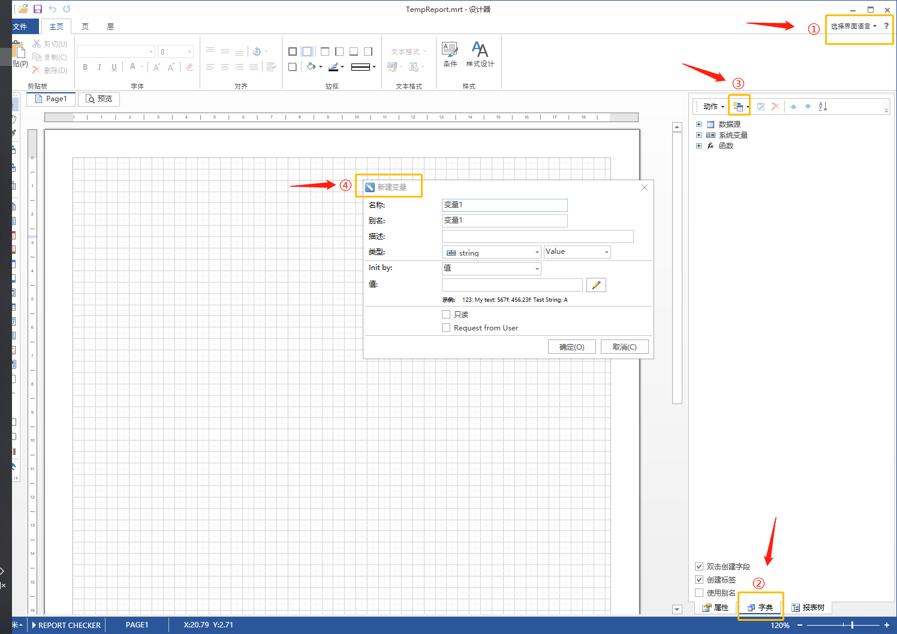
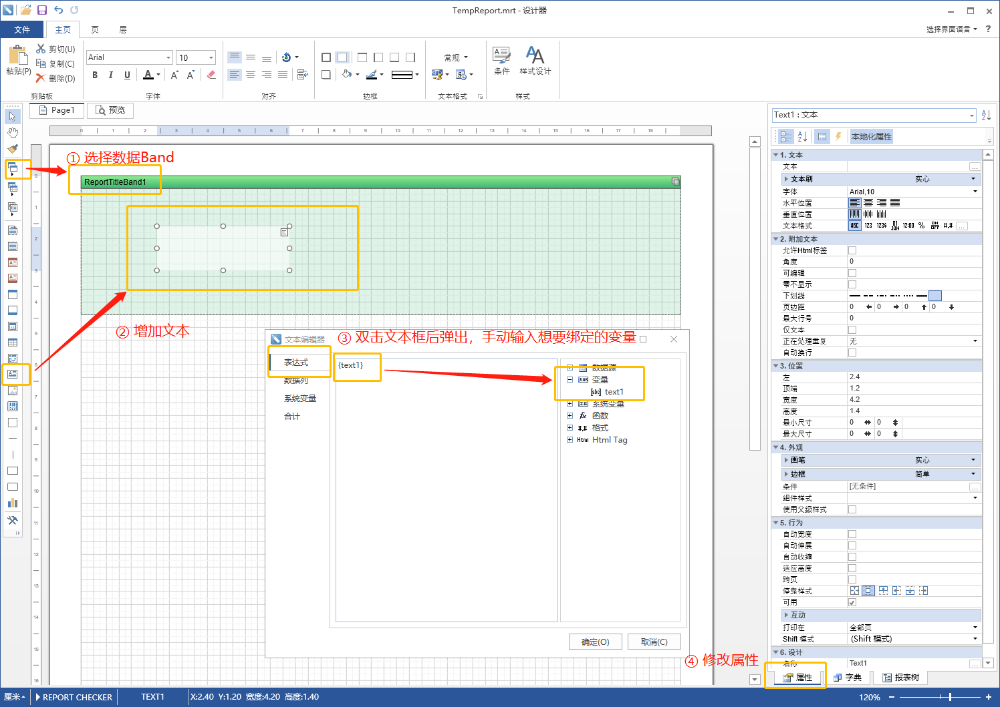
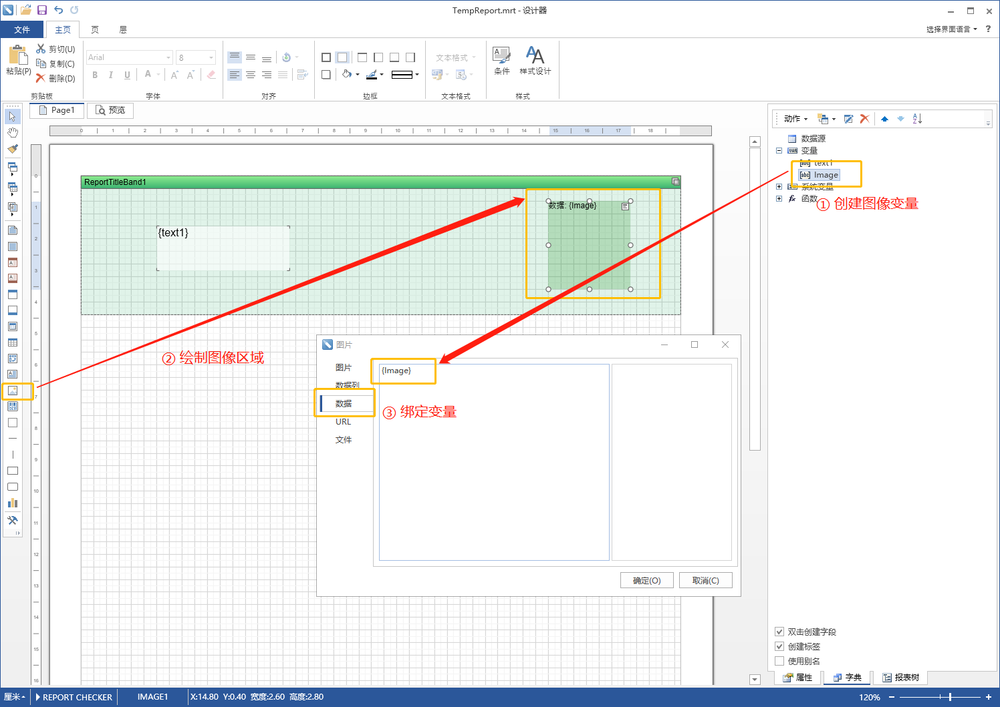
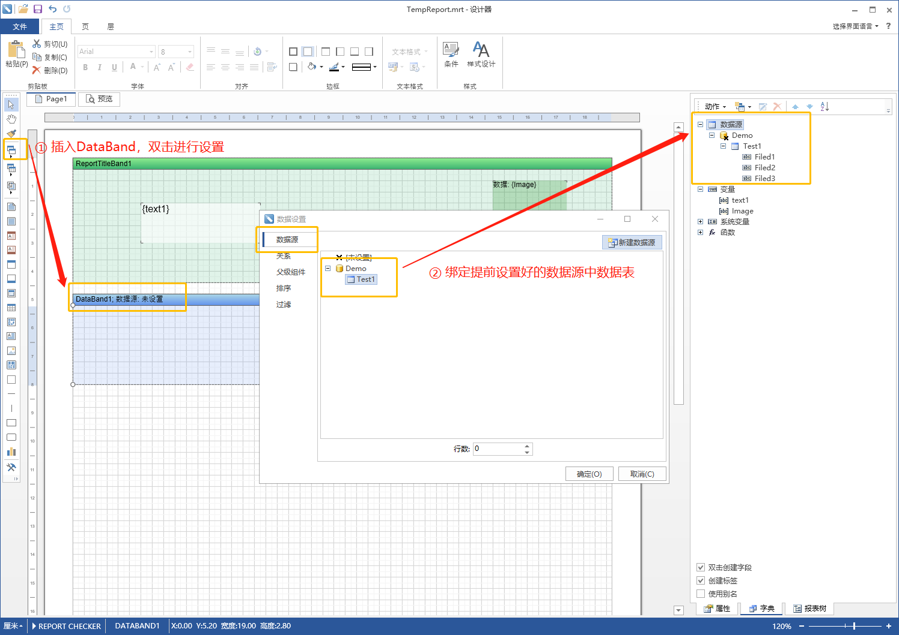
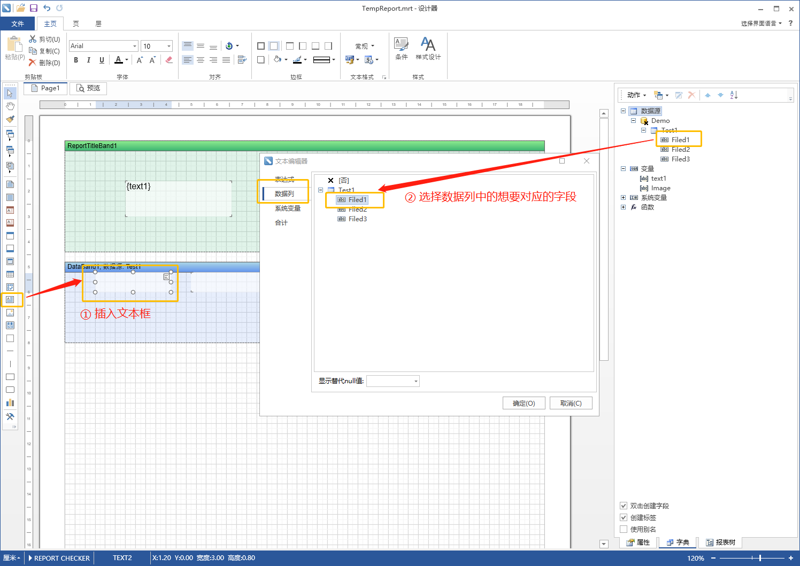
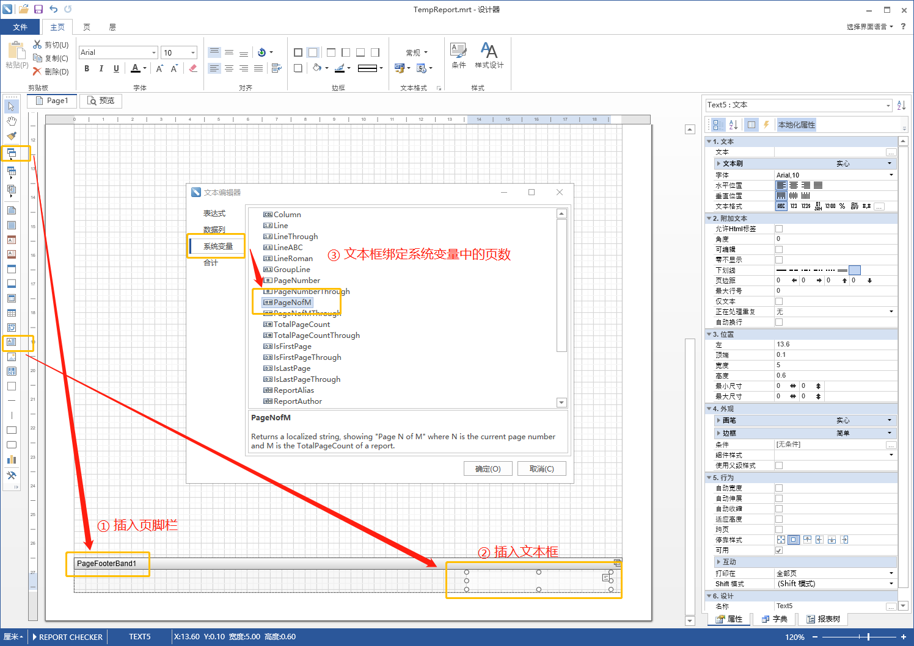
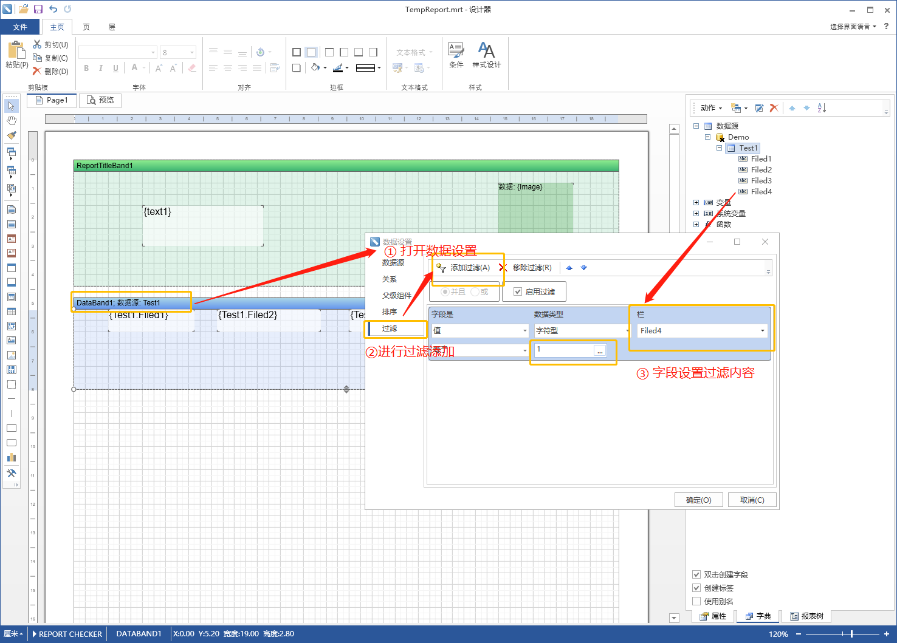

* content
{:toc}

## 一、概述

StimulsoftReports是一组报表组件，俄罗斯人做的进行全球售卖，功能非常强大。本人是在WPF中使用，用其可视化的设计器设计样式，来完成报表导出/打印功能。


## 二、基本使用

### 2.1 报表设计

1.  打开软件。双击应用程序 Designer.Wpf.exe，进入报表设计器。默认英文，可以选择右上角选择框进行语言切换，此处选择Chinese(Simplified)简体中文。

2. 创建当前报表所需变量和数据源。字典-新建变量/新建数据源来进行创建，数据源选择从DataSet/DataTable中获取数据。增加栏（即字段），即可获得各列。

3. 绘制report。在左边侧栏中选择想要的数据项进行绘制，注意数据需要在Band中存放否则会每页打印。

   + 文本：可以将文本放到数据区，单击属性即可选择相应的外观设置。双击文本框在表达式一栏中**手动**输入所对应的刚才创建的变量，用大括号包围。

   + 图像：新建变量，选择类型为图像类型。绘制图像栏，双击弹出弹窗中输入数据一栏为刚才所建变量，即可绑定变量与图像。
   + 数据表：添加DataBand数据区，双击该区域即可弹出数据源设置，选择所需的数据源。在其中插入文本框绑定数据表中的字段，即可在表中显示数据。
   + 其他：表头、多级标题等可用HeaderBand、FooterBand中添加文本框来完成。页脚也可以在所提供的Band中选择设置。

### 2.2 C#数据导入报表

1. 前置设置。WPF项目提前导入报表相关的dll。

2. 基本结构。加载-编译-呈现。

   ```c#
   StiReport report = new StiReport();
   report.Load(@"F:\Temp\PrintReport.mrt"); //绘制后生成的mrt的路径
   report.Compile();
   //绑定数据
   report.ShowWithWpf();
   ```

3. 绑定数据。

   + 基本变量。变量可以直接通过以下方式绑定。

     ```C#
      report["text1"] = "测试字段1";
     ```

   + 图像。获取图像的byte[]，将其绘制成image，绑定变量即可。

     ```c#
     FileStream fileStream = new FileStream(@"F:\Temp\1473.jpg", FileMode.Open, FileAccess.Read, FileShare.Read); //随便读取一图片
                 
     byte[] bytes = new byte[fileStream.Length]; // 读取文件的 byte[]
     fileStream.Read(bytes, 0, bytes.Length);
     fileStream.Close();
                 
     MemoryStream ms = new MemoryStream(bytes); // 把 byte[] 转换成 Stream
     System.Drawing.Image image = System.Drawing.Image.FromStream(ms);
     
     report["Image"] = image;
     ```

   + 数据表。使用DataSet和DataTable，其中DataSet类似看作数据库，DataTable看作数据表。DataTable先添加列（和设计中的类型要一致），再添加行。最后将DataTable添加到DataSet中，绑定DataSet。

     ```c#
      DataSet ds = new DataSet("Demo");
     
      DataTable testTable = new DataTable("Test1");
      testTable.Columns.Add(new DataColumn("Filed1", typeof(string)));
      testTable.Columns.Add(new DataColumn("Filed2", typeof(string)));
      testTable.Columns.Add(new DataColumn("Filed3", typeof(string)));
     
      for (int i = 0; i < 200; i++)
      {
           DataRow dr = testTable.NewRow();
           dr["Filed1"] = "aaaa";
           dr["Filed2"] = "bbbb";
           dr["Filed3"] = "cccc";
     
           testTable.Rows.Add(dr);
      }
      ds.Tables.Add(testTable.Copy());C
     
      report.RegData(ds);
      report.Dictionary.Synchronize();
     ```


## 三、多报表绑定资源问题

问题描述：当一个报表想要显示两个数据表的时候，无法显示，尝试做如下操作

+ 将两个DataTable放入DataSet中，绑定DataSet 【×】
+ 绑定两个DataSet，分别放置一个DataTable【×】

解决：纠结了许久，进行网络搜索找到了一个方法，就是从始至终只使用一个DataTable，要加的表的字段一直往上叠加（各个表字段名称不能相同）。之后使用过滤功能，将没有某个字段的内容搜出来即可（可以设置为一个不为空时也始终不会出现的值）。

```c#
// 表1字段：Filed1 Filed2 Filed3  表2字段：Filed4 Filed5
DataSet ds = new DataSet("Demo");

DataTable testTable = new DataTable("Test1");
testTable.Columns.Add(new DataColumn("Filed1", typeof(string)));
testTable.Columns.Add(new DataColumn("Filed2", typeof(string)));
testTable.Columns.Add(new DataColumn("Filed3", typeof(string)));

testTable.Columns.Add(new DataColumn("Filed4", typeof(string)));
testTable.Columns.Add(new DataColumn("Filed5", typeof(string)));

//表1数据添加时，将Filed4设置为实质上表2该字段不会出现的值，比如1
for (int i = 0; i< 200; i++)
{
	DataRow dr = testTable.NewRow();
	dr["Filed1"] = "aaaa";
	dr["Filed2"] = "bbbb";
	dr["Filed3"] = "cccc";

    dr["Filed4"]="1";
	testTable.Rows.Add(dr);
}

//表2数据添加时，将Filed1设置为实质上表2该字段不会出现的值，比如1
for (int i = 0; i< 200; i++)
{
	DataRow dr = testTable.NewRow();
	dr["Filed4"] = "aaaa";
	dr["Filed5"] = "bbbb";
	
    dr["Filed1"]="1";
	testTable.Rows.Add(dr);
}
ds.Tables.Add(testTable.Copy());
report.RegData(ds);
report.Dictionary.Synchronize();
```

报表过滤：


## 四、参考

[1] [HayvinYan]( https://www.cnblogs.com/alonghay/ ) : [Stimulsoft Reports筛选数据来绑定显示2个报表]( https://www.cnblogs.com/alonghay/p/3359863.html )

[2] StackoverFlow [Kūrosh](https://stackoverflow.com/users/1383604/k%c5%abrosh) : [pass byte[] to stimulsoft using variable to display on image]( https://stackoverflow.com/questions/31690921/pass-byte-to-stimulsoft-using-variable-to-display-on-image )


