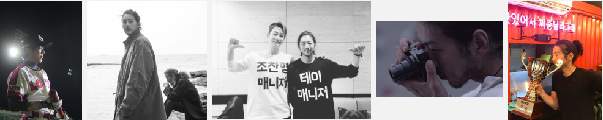

* content
{:toc}
​		致力于成为技术大牛的菜鸟程序员一枚:) 目前以Peter大神的[《Teach Yourself Programming in Ten Years》]( http://norvig.com/21-days.html )为根本思想，以陈皓大神的[《程序员练级攻略》]( https://coolshell.cn/articles/18360.html )为指导方法，朝着技术大牛的方向进发~~

​		希望靠技术赚的钱能供养自己心无旁骛地探索知识的世界，这个过程中如果有能帮助到他人的地方那就再好不过。期望自己可以为这个互联网时代的发展做出一份值得后人记录的贡献。梦想着有天能获得图灵奖，当然没获奖也没关系，“取法其上，得乎其中”，相信自身能完全完成前两个目标了~

### 爱生活

​		吃喜欢的食物时心情会很好，然而几乎没有不喜欢的食物所以每天都要消耗意志来控制食量；基本每天都会花时间进行如游泳、羽毛球、瑜伽、力量训练等运动，目的是为了能活的更久和能邂逅更多的美食；虽然比较宅，但也会偶尔和家人旅旅游，欣赏自然风光开阔胸怀顺便温习下“寄蜉蝣于天地，渺沧海之一粟”等思想来控控脑子里的水。

### 爱编程

​		喜欢编程，代码比人类好懂多了；对于相关知识的学习有点像喜欢囤货的小松鼠，虽然好像很多内容更有针对性集中学习会更好；学习到新知识会有发自内心的愉悦感，这也是我不断学习的动力。

### 爱灿哥

​		对灿哥的喜爱承载了自己对美好事物的向往吧。爱灿哥，希望自己可以像灿哥一样知世故而不世故、经历人生的起起伏伏后既有处变不惊的成熟稳重，又依然保持纯粹的澄澈的一颗赤子之心；能有跟他的一样的神仙爱情就更好了（话说甜甜的爱情什么时候能轮到我啊。。最后希望灿哥天天开心呀，난 널 영원히 지지할 것이다！❤

